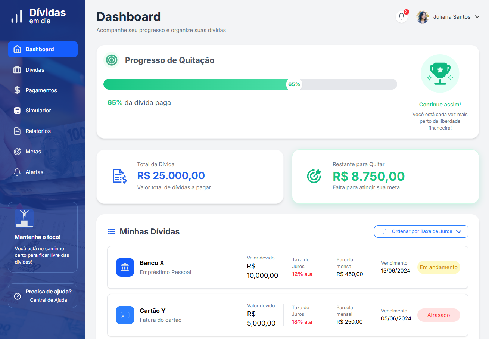

# 💸 Dívidas em Dia

Dashboard desenvolvido para auxiliar no acompanhamento e organização de dívidas, permitindo visualizar o progresso de quitação e as principais informações financeiras de forma clara e intuitiva.

## 📸 Preview



## ✨ Funcionalidades

- 📊 Dashboard com visão geral das dívidas
- 📈 Barra de progresso de quitação
- 💰 Cards de resumo financeiro
- 📋 Lista de dívidas com status
- 🔔 Área de notificações
- 📱 Layout responsivo para desktop e mobile
- 🎨 Interface baseada em protótipo desenvolvido no Figma

## 🛠 Tecnologias utilizadas

- HTML5
- CSS3
- Tailwind CSS
- SVG
- Git e GitHub
- Figma

## 📂 Estrutura do projeto

```text
.
├── dist
├── images
├── src
├── index.html
├── package.json
└── README.md
```

## 🚀 Como executar

1. Clone este repositório:

```bash
git clone https://github.com/seu-usuario/seu-repositorio.git
```

2. Instale as dependências:

```bash
npm install
```

3. Gere o CSS:

```bash
npm run build
```

4. Abra o arquivo `index.html` no navegador.

## 🎓 Projeto acadêmico

Esta é a primeira página do projeto que estou desenvolvendo no curso de Análise e Desenvolvimento de Sistemas da FIAP. O objetivo é criar uma aplicação web para uma Fintech, com foco em ajudar os usuários a organizarem melhor suas finanças. Nesta etapa, utilizei HTML, CSS e Tailwind CSS.

---

Desenvolvido por **Liliane Fontinele dos Santos** 